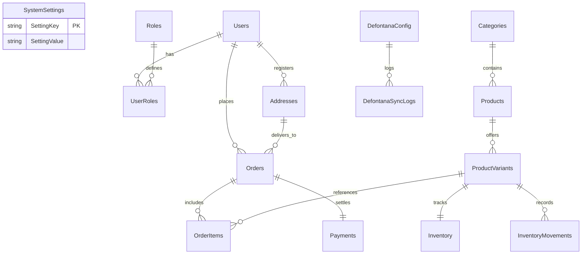

# Arquitectura de Datos: Pan de Rey (MySQL / MariaDB)

Este documento detalla el diseño relacional de la base de datos MySQL/MariaDB adaptada para el hosting de producción de Pan de Rey.

---

## Estructura de Tablas

### 1. Sistema & Configuración (CMS)
- **SystemSettings**: Guarda las claves de configuración del sistema (tipos de banner, imágenes del banner, textos de eventos, datos de contacto, enlaces de redes sociales, visión/misión y configuraciones SMTP para correos).

### 2. CRM (Clientes & Roles)
- **Users**: Almacena clientes y administradores con su correo, contraseña hasheada, teléfono y nombres.
- **Roles**: Contiene los roles del sistema (`Admin` y `Cliente`).
- **UserRoles**: Tabla pivote para asociar múltiples roles a los usuarios.
- **Addresses**: Libreta de direcciones de envío de los clientes. Incluye coordenadas de latitud/longitud y comuna para cálculo de costo de delivery.

### 3. Catálogo & Stock
- **Categories**: Categorías de productos con slugs amigables para URLs.
- **Products**: Productos de la tienda con precio base, código de mapeo con Defontana (`DefontanaProductCode`) e imágenes.
- **ProductVariants**: Variantes específicas (ej. 'Clásico', 'Con Semillas') asociadas a un SKU específico del ERP.
- **Inventory**: Registro del stock disponible por variante y búfer de seguridad (`SafetyBuffer`).
- **InventoryMovements**: Historial de movimientos de inventario (ventas, compras, ajustes de stock, reservas temporales).

### 4. Ventas, Pagos & Despacho
- **Coupons**: Cupones de descuento configurables por categoría o producto específico.
- **Orders**: Registro de pedidos realizados. Guarda costo de despacho, método de despacho (`Retiro` o `Delivery`), estado del pedido (`Nuevo`, `Preparando`, `Listo`, `En Ruta`, `Entregado`, `Cancelado`), número de boleta electrónica emitida y estado de impresión fiscal.
- **OrderItems**: Detalle de productos comprados en cada pedido.
- **Payments**: Registro de transacciones financieras. Guarda el método de pago (`Webpay`, `Transferencia`, `Efectivo`), estado del pago (`Pendiente`, `Aprobado`, `Rechazado`) y token de pasarela.

### 5. Integración ERP Defontana
- **DefontanaConfig**: Almacena las credenciales de la API de Defontana para la renovación automática del token de acceso OAuth2.
- **DefontanaSyncLogs**: Bitácora para rastrear sincronizaciones automáticas de stock e inserción de ventas.

---

## Relaciones Clave (Modelo Relacional)

